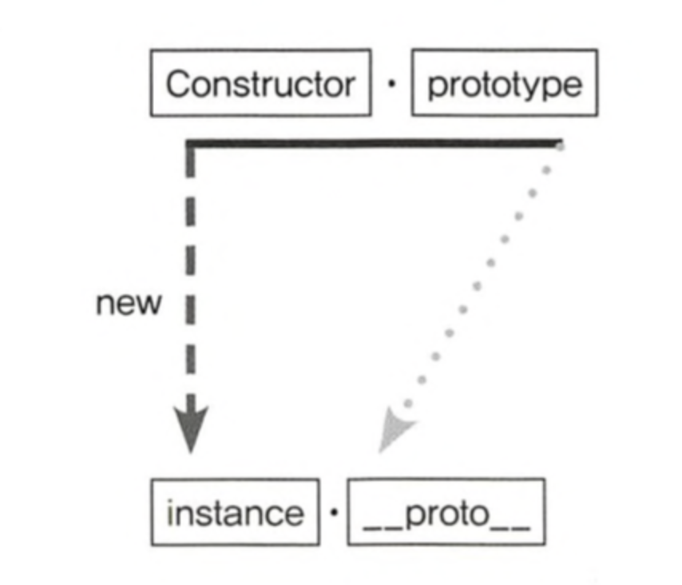
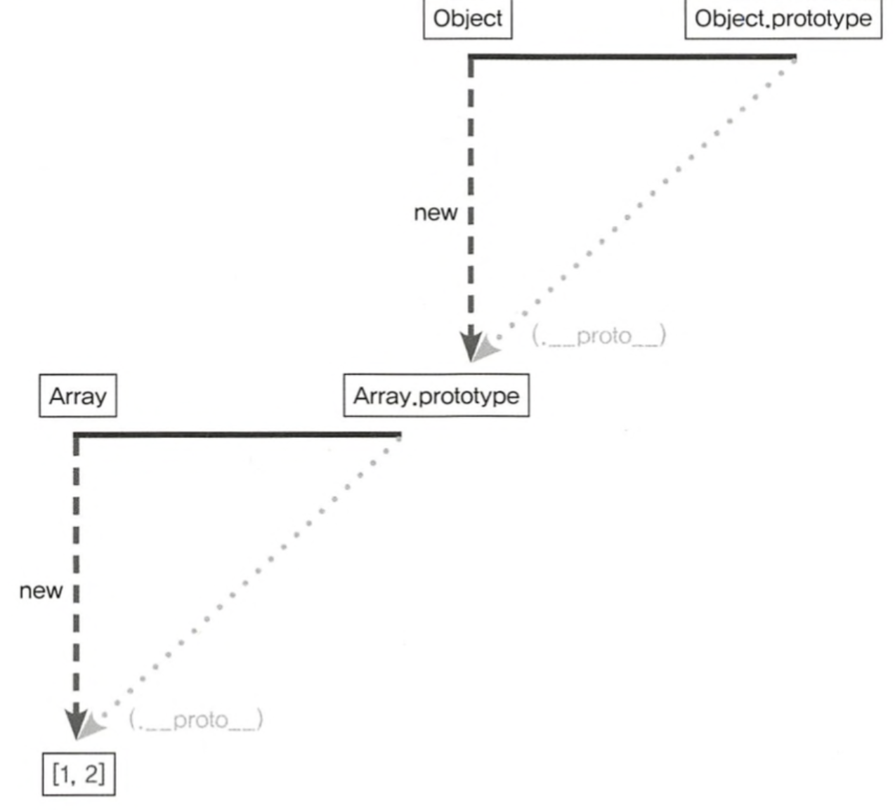

### 프로토타입의 개념과 이해

자바스크립트는 프로토타입 기반 언어입니다. 클래스 기반 언어에서는 '상속'을 사용하지만 프로토타입 기반 언어에서는 어떤 객체를 원형으로 삼고 이를 복제함으로써 상속과 비슷한 효과를 얻습니다.

```javascript
let instance = new Constructor();
```



- 어떤 생성자 함수(Constructor)를 new 연산자와 함께 호출하면
- Constructor에서 정의된 내용을 바탕으로 새로운 인스턴스가 생성된다.
- 이때 instance에는 **proto**라는 프로퍼티가 자동으로 부여되는데 이 프로퍼티는 Constructor의 prototype 이라는 프로퍼티를 참조한다.

prototype와 이를 참조하는 **proto**는 모두 객체이다. prototype 객체 내부에는 인스턴스가 사용할 메서드를 저장한다.

```javascript
let suzi = new Person("Suzi");
suzi.__proto__.getName(); // undefined

Person.prototype === suzi.__proto__; // true
```

undefined가 출력되는 이유는 함수를 메서드로서 호출하면 바로 앞의 객체가 곧 this가 되기 때문이다. **proto** 객체에는 name 프로터티가 없기 때문에 undefined가 반환된다.

this를 인스턴스로 사용하고 싶다면 **proto**를 생략하면 된다.
이런점떄문에 생성자 함수의 prototype에 어떤 메서드나 프로퍼티가 있다면 인스턴스에서도 마치 자신의 것처럼 메서드나 프로퍼티에 접근할 수 있게 되는 것이다.

```javascript
suzi.__proto__.getName
=> suzi(.__proto__).getName
=> suzi.getName
```

### constructor 프로퍼티

생성자 함수의 프로퍼티인 prototype 객체 내부에는 constructor라는 프로퍼티가 있습니다. 인스턴스의 **proto** 객체 내부에도 마찬가지입니다.
**이 프로퍼티는 단어 그대로 원래의 생성자 함수를 참조합니다.**
이를 통해 인스턴스로부터 그 원형을 알 수 있게 됩니다.

```javascript
let arr = [1, 2];
Array.prototype.constructor == Array; // true
arr.__proto__.constructor == Array; // true
arr.constructor == Array; // true

let arr2 = new arr.constructor(3, 4);
console.log(arr2); // [3, 4]
```

constructor는 읽기 전용 속성(기본형 리터럴 변수 - number, string, boolean)이 부여된 예외적인 경우를 제외하고는 값을 바꿀 수 있다.

```javascript
let NewConstructor = function () {
  console.log("this is new constructor!");
};
let dataTypes = [
  1, // Number & false
  "test", // String & false
  true, // Boolean & false
  {}, // NewConstructor & false
  [], // NewConstructor & false
  function () {}, // NewConstructor & false
  /test/, // NewConstructor & false
  new Number(), // NewConstructor & false
  new String(), // NewConstructor & false
  new Boolean(), // NewConstructor & false
  new Object(), // NewConstructor & false
  new Array(), // NewConstructor & false
  new Function(), // NewConstructor & false
  new RegExp(), // NewConstructor & false
  new Date(), // NewConstructor & false
  new Error(), // NewConstructor & false
];

dataTypes.forEach(function (d) {
  d.constructor = NewConstructor;
  console.log(d.constructor.name, "&", d instanceof NewConstructor);
});
```

그러나, 위에 예외적인 경우를 제외하고 NewConstructor 가 부여되었음에도 `d instanceof NewConstructor` 명령어에 대해 false를 반환하는데, constructor를 변경하더라도 참조하는 대상이 변경될 뿐 이미 만들어진 인스턴스의 원형이 바뀐다거나 데이터 타입이 변하는 것은 아님을 알 수 있다. 어떤 인스턴스의 생성자 정보를 알아내기 위해 constructor 프로퍼티에 의존하는 것이 항상 안전하지는 않다는 것을 알 수 있다.

### 메서드 오버라이드

만약 인스턴스가 동일한 이름의 프로퍼티 또는 메서드가 존재하게된다면 ?

```javascript
var Person = function (name) {
  this.name = name;
};

Person.prototype.getName = function () {
  return this.name;
};

var juyi = new Person("juyi");
juyi.getName = function () {
  return "Have a good day~ " + this.name;
};

console.log(juyi.getName()); // Have a good day~ juyi
```

메서드위에 메서드를 덮어씌웠다는 표현으로, 자바스크립트 엔진이 getName이라는 메서드를 찾는 방식은 가까운 대상인 자신의 프로퍼티를 검색하고, 없으면 그 다음으로 가까운 대상인 **proto**를 검색하는 순서로 진행하게 됩니다. 즉, 순서가 밀리기 때문에 **proto**의 메서드가 노출되지 않은 것입니다.
juyi라는 객체에 getName이라는 메서드가 있어 juyi 객체에 있는 getName의 메서드가 호출되었습니다.

만일 인스턴스를 바로보도록 바꾸고싶으시면 call or apply를 사용

```
console.log(iu.__proto__.getName.call(iu)); // 'juyi'
```

### 프로토타입 체인

```
console.dir([1, 2]);
```

배열의 내부 구조를 보면 **proto**안에 다시 **proto**가 있는 것을 확인할 수 있다. 이는 prototype 객체가 객체이기 때문이다.



**proto**는 생략이 가능하기 때문에, 배열은 Array.prototype 내부의 메서드를 자신의 것처럼 사용할 수 있다. 즉, 객체 메서드로 실행이 가능한 것이다.

```javascript
let arr = [1, 2];
arr(.__proto__).push(3);
arr(.__proto__)(.__proto__).hasOwnProperty(2); // Array.prototype이 Object라서 가능함
```

### 객체 전용 메서드의 예외사항

어떤 생성사 함수이든 prototype은 반드시 객체이기 때문에 Object.prototype이 언제나 프로토타입 체인의 최상단에 존재한다. 따라서 객체에서만 사용할 메소드는 다른 여느 데이터 타입처럼 프로토타입 객체 안에 정의할 수 없다. 객체에서만 사용할 메서드를 Objcet.prototype 내부에 정의한다면 다른 데이터타입도 해당 메서드를 사용할 수 있게 되기 때문이다.

```javascript
Object.prototype.getEntries = function () {
  let res = [];
  for (let prop in this) {
    if (this.hasOwnProperty(prop)) {
      res.push([prop, this[prop]]);
    }
  }
  return res;
};
let data = [
  ["object", { a: 1, b: 2, c: 3 }], //[["a",1], ["b",2],["c",3]]
  ["number", 345], // []
  ["string", "abc"], //[["0","a"], ["1","b"], ["2","c"]]
  ["boolean", false], //[]
  ["func", function () {}], //[]
  ["array", [1, 2, 3]],
  // [["0", 1], ["1", 2], ["2", 3]]
];
data.forEach(function (datum) {
  console.log(datum[1].getEntries());
});
```

의도대로라면 객체가 아닌 다른 데이터 타입에서는 오류를 던져야하는데, 어떤 데이터 타입이건 거의 무조건 프로토타입 체이닝을 통해 getEntries메서드에 접근할 수 있으니 그렇게 동작하지않는다.(최상위가 Object.prototype이라서)

이러한 이유로 객체만을 대상으로 동작하는 메서드들은 Object.prototype이 아닌 Objcet에 스태틱 메서드(static method)로 부여할 수 밖에 없다.

**[Obejct.create]**

'프로토타입 체인상 가장 마지막에는 언제나 Object.prototype이 있다'고 했는데,
예외적으로 Object.create를 이용하면 Object.prototype에 접근할 수 없는 경우가 있다.
Object.create(null)은 **proto**가 없는 객체를 생성한다.

```javascript
let _proto = Object.create(null);
_proto.getValue = function (key) {
  return this[key];
};
let obj = Object.create(_proto);
obj.a = 1;
console.log(obj.getValue("a")); // 1
console.dir(obj);
```

obj를 출력해보면, **proto**에는 오직 getValue 메소드만 존재하며, **proto** 및 constructor 프로퍼티 등은 보이지 않는다.
**이 방식으로 만든 객체는 일반적인 데이터에서 반드시 존재하던 내장 메소드 및 프로퍼티들이 제거됨으로써 기본 기능 제약이 생긴 대신, 객체 자체의 무게가 가벼워짐으로써 성능상 이점을 가진다.**

### 다중프로토타입체인

https://github.com/FromEdiya/coreJavaScript/blob/main/contents/06.%ED%94%84%EB%A1%9C%ED%86%A0%ED%83%80%EC%9E%85/2.%ED%94%84%EB%A1%9C%ED%86%A0%ED%83%80%EC%9E%85%EC%B2%B4%EC%9D%B8/2-4.%EB%8B%A4%EC%A4%91%ED%94%84%EB%A1%9C%ED%86%A0%ED%83%80%EC%9E%85%EC%B2%B4%EC%9D%B8.md

위의 깃헙에서 잘 설명이 되어있다..
