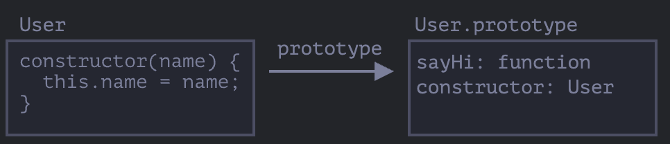
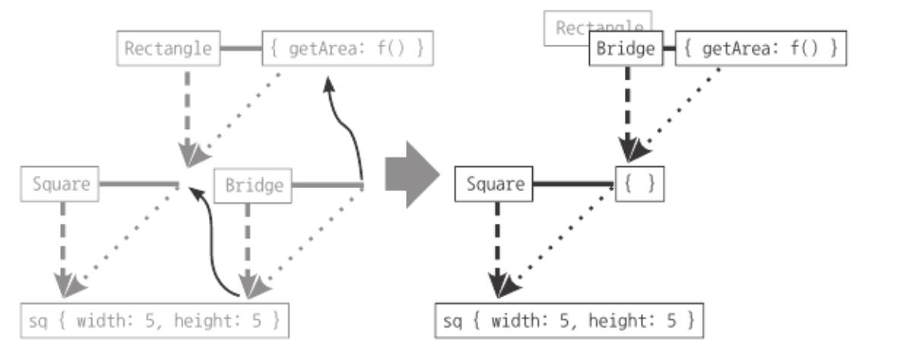

자바스크립트에서 `class`는 ES6에서 추가된 문법으로, `class`도 내부적으로 일부 프로토타입 개념을 활용하고 있으며, ES5 체제 하에서 클래스를 흉내내기 위한 구현 방법을 알고 넘어갈 필요는 있다고 설명하고 있습니다.

### 클래스와 인스턴스의 개념 이해

일반적으로 클래스는 '설계도, 계급, 집단, 집합'의 느낌이고, 인스턴스는 해당 설계를 바탕으로 구현된 실체로 정의될 수 있습니다.

클래스는 다른 클래스에 상속할 수 있고, 여러 클래스에 상속이 가능합니다.

'음식'이라는 클래스 하위에는 '과일' 클래스가 존재할 수 있습니다.

'음식', '과일'클래스는 모두 집단 즉, 클래스 개념이고
'음식'은 '과일'의 상위의 개념입니다. (superior)

'과일' 안에는 더 구체적은 예시가 존재할텐데, 예를 들어 오렌지, 포도, 자몽.. 이러한 구체적인 사례가 인스턴스의 개념입니다.

정리하자면, 하나의 개체를 정의한 클래스를 바탕으로 인스턴스를 만들 때 비로소 어떤 개체가 클래스의 속성을 가지게 됩니다.

### 자바스크립트의 클래스

객체를 여러개 생성해야할 때 우리는 new연산자와 함께 생성자 함수를 사용하여 객체를 생성할 수 있습니다.

```javascript
function User(name) {
  this.name = name;
  this.isAdmin = false;
}

let user = new User("보라");
```

여기에 더하여 ES6에 도입된 class라는 문법을 통해 개체를 생성할 수 있습니다.

여기서 놀랍게도 클래스는 함수의 한 종류입니다.

```javascript
class User {
  constructor(name) {
    this.name = name;
  }
  sayHi() {
    alert(this.name);
  }
}

// User가 함수라는 증거
alert(typeof User); // function
```

어떻게 함수의 한 종류인지 파헤쳐보자면
`class User {...}` 문법 구조가 진짜 하는 일은 아래와 같습니다.

1. `User`라는 이름을 가진 함수를 만듭니다. 함수 본문은 생성자 메서드 `constructor`에서 가져옵니다. 없으면 비워진 채로 만들어집니다.
2. `sayHi`같은 클래스 내에서 정의한 메서드를 `User.prototype`에 저장합니다.



```javascript
class User {
  constructor(name) {
    this.name = name;
  }
  sayHi() {
    alert(this.name);
  }
}

// 클래스는 함수입니다.
alert(typeof User); // function

// 정확히는 생성자 메서드와 동일합니다.
alert(User === User.prototype.constructor); // true

// 클래스 내부에서 정의한 메서드는 User.prototype에 저장됩니다.
alert(User.prototype.sayHi); // alert(this.name);

// 현재 프로토타입에는 메서드가 두 개입니다.
alert(Object.getOwnPropertyNames(User.prototype)); // constructor, sayHi
```

위에서 볼 수 있듯이 클래스에서는 프로토타입의 개념이 어느정도 사용되고 있습니다.

```javascript
const user1 = new User("juyi"); // user1 인스턴스 생성
user1.sayHi();
```

User라는 클래스를 통해 user1 이라는 인스턴스를 생성합니다.
위에서 설명드렸듯이, User 클래스 내부의 메서드는 prototype안에 정의된다고 하였는데요.
그래서 user1.sayHi()로 호출이 가능하게 됩니다. (user1.**proto**.sayHi 인거죠..! **proto** 생략되었으니 )

이렇게 인스턴스에 상속되는 내부 메서드를 `프로토타입 메서드`라고 부르기로 했습니다.

여기서 인스턴스가 참조하는 지 여부에따라서 스태틱멤버와 인스턴스 멤버로 나뉘게 되는데, 인스턴스 멤버에는 prototype 에 선언된 부분들이 들어갈 것이고 스태틱 멤버에는 static 으로 선언된 부분들이 들어가게 될것입니다.

```javascript
// 생성자 함수
var Rectangle = function (width, height) {
  this.width = width;
  this.height = height;
};
// 프로토타입 메서드
Rectangle.prototype.getArea = function () {
  return this.width * this.height;
};

// 스태틱 메서드
Rectangle.isRectangle = function (instance) {
  return (
    instance instanceof Rectangle && instance.width > 0 && instance.height > 0
  );
};

var rect1 = new Rectangle(3, 4); // 인스턴스 생성
console.log(rect1.getArea()); // 12 (인스턴스에 할당된 프로토타입 메서드)
console.log(rect1.isRectangle(rect1)); // Error
console.log(Rectangle.isRectangle(rect1)); // true
```

클래스로 다시 표현

```javascript
class Rectangle {
  constructor(width, height) {
    this.width = width;
    this.height = height;
  }

  // 프로토타입 메서드
  getArea() {
    return this.width * this.height;
  }

  // 스태틱 메서드
  static isRectangle(instance) {
    return (
      instance instanceof Rectangle && instance.width > 0 && instance.height > 0
    );
  }
}

const rect1 = new Rectangle(3, 4); // 인스턴스 생성
console.log(rect1.getArea()); // 12 (인스턴스에 할당된 프로토타입 메서드)
console.log(Rectangle.isRectangle(rect1)); // true (스태틱 메서드 호출)
console.log(rect1.isRectangle(rect1)); // Error
```

### 클래스 상속

ES5에서는 클래스 상속을 어떻게 표현했는 지를 살펴보게 됩니다. ES6에서 클래스가 도입되긴했지만 역시나 prototype을 기반으로 한 것으로 기본적으로 아래 '다중 프로토타입 체인' 개념과 동일합니다.
**결론적으로 자바스크립트에서 클래스 상속을 구현했다는 것은 결국 프로토타입 체이닝을 잘 연결한 것으로 이해하면 됩니다.**

```javascript
// 유사배열객체 생성자 함수
var Grade = function () {
  var args = Array.prototype.slice.call(arguments);
  for (var i = 0; i < args.length; i++) {
    this[i] = args[i];
  }
  this.length = args.length;
};

Grade.prototype = []; // Array 내장 클래스를 상속받는 Grade 클래스
var g = new Grade(100, 80);
```

그러나, 이렇게 표현을 했을 때 문제점은 length 프로퍼티를 삭제 및 제어할 수 있게되고, Grade.prototype이 빈배열을 참조하고 있음으로 일반 객체의 성질을 그대로 지니고 있게 됩니다.

```javascript
g.push(90);
console.log(g); // Grade { 0:100, 1:80, 2:90, length:3 }

delete g.length;
console.log(g); // Grade { 0:100, 1:80, 2:90 }

g.push(70);
console.log(g); // Grade { 0:70, 1:80, 2:90 , length:1 }
```

`length:1` 이 된 까닭은 push(70)명령어를 통해 자바스크립트 엔진이 length를 읽으려고 하는데, g.length가 없음으로 프로토타입 체이닝을 타고 g.**proto**.length 를 읽어오게 된 것입니다.
g.**proto**.length = 0 이기 때문에, 1만큼 증가하라는 명령이 문제없이 동작하게 됩니다.

**이처럼 클래스에 있는 값이 인스턴스의 동작에 영향을 줘서는 안되는 것입니다.**

다른 예시도 함께 보겠습니다.

### 사용자 정의 클래스 구현과 두 문제점

[처음 상태]

```javascript
var Rectangle = function (width, height) {
  this.width = width;
  this.heigth = height;
};
Rectangle.prototype.getArea = function () {
  return this.width * this.height;
};
var rect = new Rectangle(3, 4);
console.log(rect.getArea());

var Square = function (width) {
  this.width = width;
  this.height = width;
};
Square.prototype.getArea = function () {
  return this.width * this.width;
};
var sq = new Square(5);
console.log(sq.getArea());
```

[상속을 통한 중복 제거]

```javascript
var Square = function (width) {
  Rectangle.call(this, width, width); // this.width, this.height에 width가 바인딩되도록 해줌.
};
Square.prototype = new Rectangle();
```

Rect 인스턴스를 prototype이 참조함으로서 rect1.**proto**가 가리키는 Rect의 prototype을 Square.prototyp이 참조하도록 해줬다. 상속의 구현!

상속을 통해 중복을 제거할 수 있었지만 두가지 문제점이 있습니다.

1. Square.prototype에 값이 존재하게 됨으로 언제든지 값을 지워버릴 수 있다.
2. constructor를 Rectangle를 바라보고 있기 때문에 Rectangle의 값을 바꿀 수도 있다.

```javascript
var rect2 = new sq.constructor(2, 3);
console.log(rect2); // Rectangle { width:2 , height: 3}
```

### 데이터 없는 클래스 구현

[방법 1: 브루트 포스]

잘못 주입된 데이터를 직접 삭제해주고, 객체를 동결시킨다.

```javascript
delete Square.prototype.width;
delete Square.prototype.height;
Object.freeze(Square.prototype);
```

[방법 2: 브릿지]

```javascript
var Rectangle = function (width, height) {
  this.width = width;
  this.height = height;
};

Rectangle.prototype.getArea = function () {
  return this.width * this.height;
};

var Square = function (width) {
  Rectangle.call(this, width, width);
};

var Bridge = function () {};
Bridge.prototype = Rectangle.prototype;
Square.prototype = new Bridge();
Object.freeze(Square.prototype);
```

'빈 함수에 다리 역할을 부여한 것'
-> Bridge라는 빈 함수를 만들고, Bridge.prototype이 Rectangle.prototype을 참조하게 한 다음, Square.prototype에 new Bridge()로 할당하면, 아래 그림처럼 Rectangle 자리에 Bridge가 대체된다.



[Object.create]

```javascript
var Rectangle = function (width, height) {
  this.width = width;
  this.height = height;
};

Rectangle.prototype.getArea = function () {
  return this.width * this.height;
};

var Square = function (width) {
  Rectangle.call(this, width, width);
};

Square.prototype = Object.create(Rectangle.prototype);
Object.freeze(Square.prototype);

const sq = new Square(3);
console.dir(sq);
```

위의 세가지 방법 모두 동일하며, 클래스가 구체적인 데이터를 지니지 않게 생성자 함수나 빈객체를 할당해주는 방식이였습니다.

그러나, 기본적인 상속은 성공하였지만 dir 찍어보면 여전히 인스턴스의 constructor는 'Rectangle'를 가리키고 있습니다.

이를 수정하면 아래와 같습니다. (하나만 예시로 들게요)

```javascript
var Rectangle = function (width, height) {
  this.width = width;
  this.height = height;
};

Rectangle.prototype.getArea = function () {
  return this.width * this.height;
};

var Square = function (width) {
  Rectangle.call(this, width, width);
};

Square.prototype = Object.create(Rectangle.prototype);
Square.prototype.constructor = Square;
Object.freeze(Square.prototype);

const sq = new Square(3);
console.dir(sq);
```

```
Square { width: 3, height: 3 }
    __proto__: Rectangle // 상속받고 있는 객체 표시
        constructor: ƒ Square(width) // 생성자
        getArea: ƒ ()
        __proto__: Object
```
