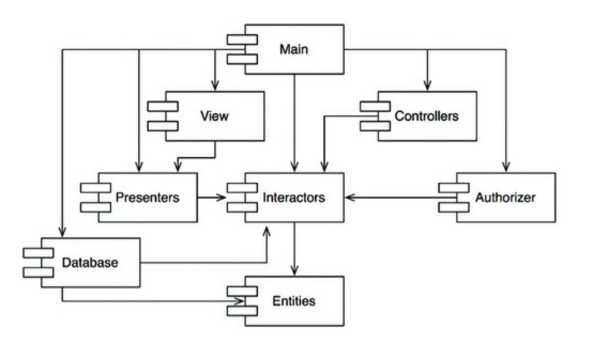
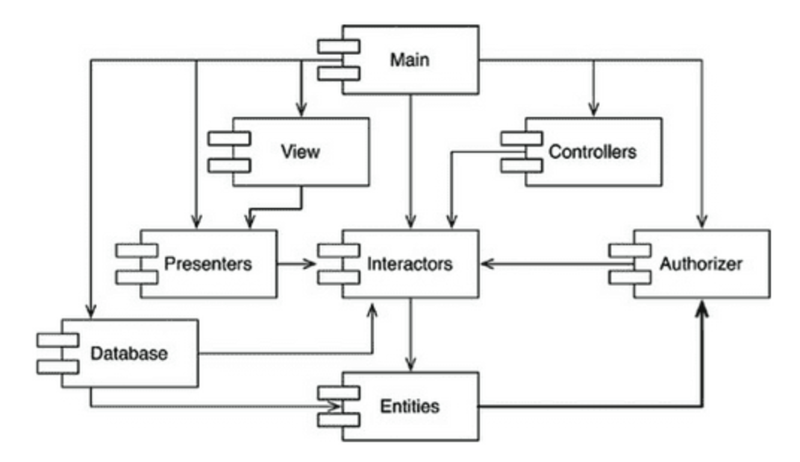
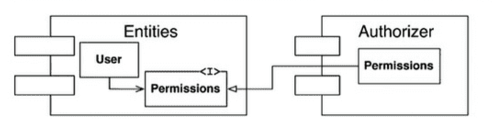
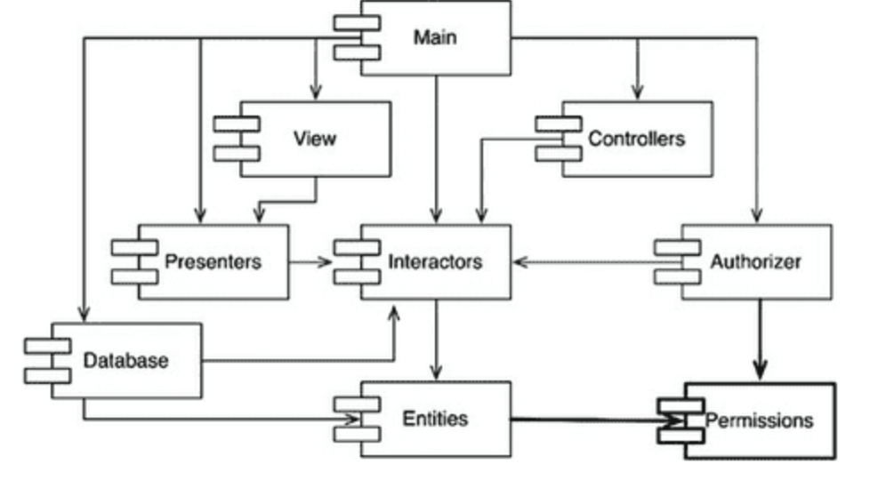

# 컴포넌트 응집도

### REP : 재사용 / 릴리스 등가 원칙

> 재사용 단위는 릴리스 단위와 같다.

아키텍처의 관점에서 단일 컴포넌트는 응집성 높은 클래스 & 모듈로 구성되어야 한다.

즉, 공유하는 중요한 테마나 목적이 같은 것끼리 구성되어야한다는 뜻이다.

### CCP : 공통 폐쇄 원칙

> 동일한 이유로 동일한 시점에 변경되는 클래스를 같은 컴포넌트로 묶어라. 서로 다른 시점에 다른 이유로 변경되는 클래스는 다른 컴포넌트로 분리하라.

이 원칙은 단일 책임 원칙 SRP 를 컴포넌트 관점에서 다시 쓴 것이다.
CCP에서도 마찬가지로 단일 컴포넌트는 변경의 이유가 여러 개 있어서는 안 된다고 말한다.

애플리케이션 코드가 반드시 변경되어야 한다면, 이러한 변경이 여러 컴포넌트 도처에 분산되어 발생하기 보다는, 차라리 변경 모두가 단일 컴포넌트에서 발생하는 편이 낫다.

따라서 CCP는 같은 이유로 변경될 가능성이 있는 클래스는 모두 한곳(하나의 컴포넌트로)으로 묶을 것을 권한다.

### CRP : 공통 재사용 원칙

> 컴포넌트 사용자들을 필요하지 않는 것에 의존하게 강요하지 말라.

공통 재사용 원칙 CRP도 클래스와 모듈을 어느 컴포넌트에 위치시킬지 결정할 때 도움되는 원칙이다. 같이 재사용되는 경향이 있는 클래스와 모듈들을 같은 컴포넌트에 포함해야 한다고 말한다.

재사용 가능한 클래스는 재사용 모듈의 일부로써 해당 모듈의 다른 클래스와 상호작용하는 경우가 많다.
CRP에서는 이런 클래스들이 동일한 컴포넌트에 포함되어야 한다고 말한다.

예시) container와 iterator - 이들 클래스는 서로 강하게 결합되어 있기 때문에 함께 재사용된다. 따라서 동일한 컴포넌트에 위치해야한다.

어떤 컴포넌트가 다른 컴포넌트를 사용하면, 두 컴포넌트 사이에 의존성이 생긴다.

사용하는 클래스에서 사용되는 클래스에서 단 하나의 클래스만 사용한다고 해도 의존성은 약해지지 않는다.

이런 의존성으로 인해 사용되는 컴포넌트가 변경될 때 마다 사용하는 컴포넌트도 변경해야할 가능성이 높다.

따라서 의존하는 컴포넌트가 있다면 해당 컴포넌트의 모든 클래스에 대해 의존함을 확실히 인지해야 한다.

**CRP는 강하게 결합되지 않은 클래스들을 동일한 컴포넌트에 위치시켜서는 안 된다고 말한다.**

<ISP와의 관계>

CRP는 인터페이스 분리 원칙(ISP)의 포괄적인 버전이다.
ISP는 사용하지 않는 메서드가 있는 클래스에 의존하지 말라고 조언한다.

CRP는 사용하지 않는 클래스를 가진 컴포넌트에 의존하지 말라고 한다.

### 컴포넌트 응집도에 대한 균형 다이어그램

- REP, CRP에만 중점을 두면, 사소한 변경이 생겼을 때 너무 많은 컴포넌트에 영향을 미침
- CCP, REP에만 중점을 두면, 불필요한 릴리스가 너무 빈번해짐
  프로젝트 초기에는 CCP가 REP보다 훨씬 중요한데, 이는 개발 가능성이 재사용성보다 더욱 중요하기 때문입니다.

프로젝트가 성숙하고 해당 프로젝트로 부터 파생된 또 다른 프로젝트가 시작되면, 프로젝트는 삼각형에서 점차 왼쪽으로 이동해 갑니다.

즉, 프로젝트의 컴포넌트 구조는 시간과 성숙도에 따라 변한다는 뜻입니다.

# 컴포넌트 결합

### ADP: 의존성 비순환 원칙

> 컴포넌트 의존성 그래프에 순환이 있어서는 안 된다.

'숙취증후군' : 내가 의존하고 있는 무언가가 수정이 되어서 작동하던 프로그램이 돌아가지 않는다. 😵

이를 해결하기 위한 2가지 방안이 있다.

1. 주단위 빌드
2. 의존성 비순환 원칙

#### 주 단위 빌드

- 5일 중 4일 동안 개발자가 각자 개발하고 하루에 몰아서 통합 및 빌드를 진행한다.
- 장점 : 빠른 피드백, 고립된 환경에서의 개발
- 단점 : 통합과 테스트를 수행하기 점점 어려워 짐.

#### 의존성 비순환 원칙

개발환경을 릴리즈 가능한 컴포넌트 단위로 분리하는 것입니다.
이를 통해 컴포넌트는 개별 개발자 또는 개발팀이 책임질 수 있는 단위가 됩니다. 이후 릴리스 번호를 부여하여 다른 팀에서 사용할 수 있도록 만듭니다.

그런 다음 각 개발팀은 자신만의 공간에서 해당 컴포넌트를 지속적으로 수정하고, 다른 팀에서는 릴리스 된 버전을 사용하면 됩니다.

새로운 버전이 나와도 다른 팀들은 해당 버전으로 통합할지는 자유롭게 결정할 수 있으므로 컴포넌트의 변경이 즉각적으로 다른 팀들에게 영향을 주지 않습니다.

하지만 이렇게 사용하기 위해서는 의존성 구조를 잘 관리 하여야 합니다. 즉, 순환되는 구조가 없도록 잘 관리되어야 합니다.

위의 그림은 '비순환 방향 그래프'로 어느 컴포넌트에서 시작하더라도 최초 컴포넌트로 돌아갈 수 없는 구조입니다.
위와 같은 구조의 릴리즈는 상향식으로 진행하면 됩니다.

#### 순환이 컴포넌트 의존성에 미치는 영향

위 그림에서 Entities에 포함된 클래스 하나가 Authorize에 포함된 클래스 하나를 사용하도록 변경하였습니다.

이떄 순환 의존성이 발생하게 됩니다.
만약 Database를 릴리즈하려고 하면, Entities뿐만 아니라 Authorize, Interactors 까지 의존하게 되어버립니다.

이는 다시 '숙취 증후군'의 경험을 일으킬 수 있고, 단위 테스트를 하고 릴리스를 하는 일도 어려워지게 됩니다.

그럼 이러한 의존성을 어떻게 끊어낼까요 ?

#### 순환 끊기

주요한 방법은 2가지가 있습니다.

1. 의존성 역전 원칙 (DIP)을 적용한다. User가 필요로 하는 메서드를 제공하는 인터페이스를 생성하고, 해당 인터페이스를 Entities에 위치시킨다.

2. Entities와 Authorizer가 모두 의존하는 새로운 컴포넌트를 만든다. 그리고 두 컴포넌트가 모두 의존하는 클래스를 새로운 컴포넌트로 이동시킨다.

이 해결책에서 시사하는 바는 요구사항이 변경되면 컴포넌트 구조 또한 변경되게 된다. 이떄 의존성 구조가 흐트러지지않도록 주의해야 한다.

### 하향식 설계
