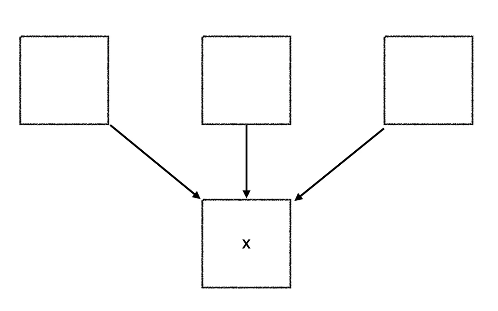
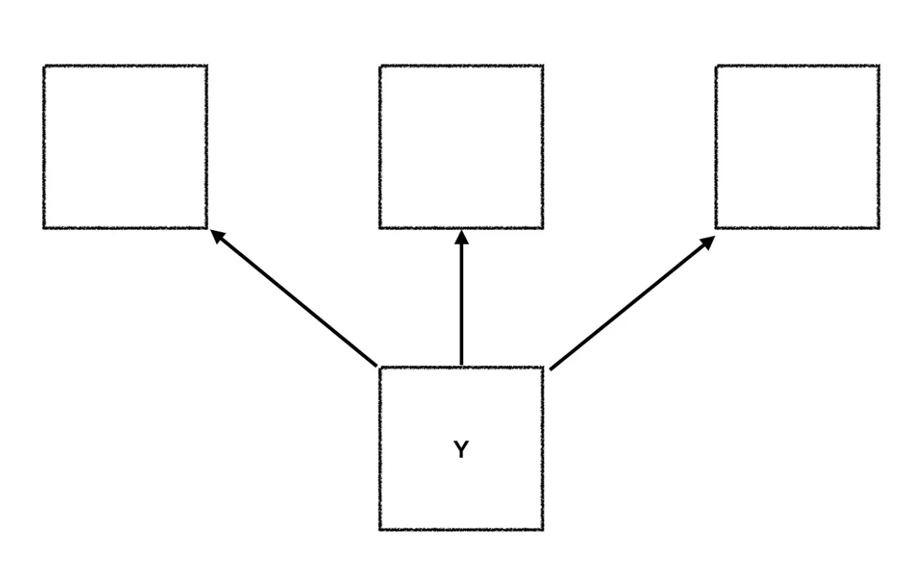
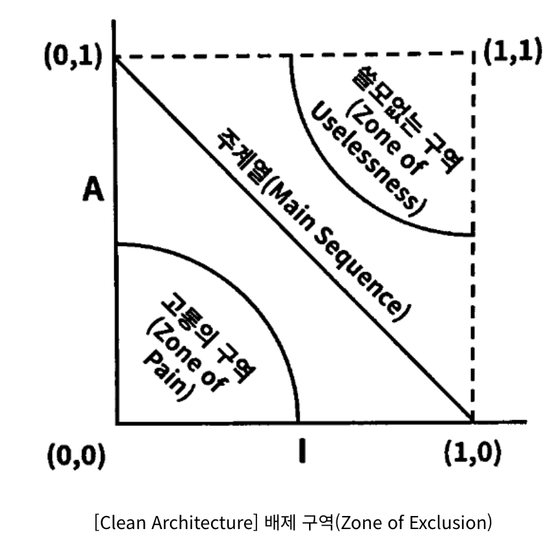

# 컴포넌트 응집도

### REP : 재사용 / 릴리스 등가 원칙

> 재사용 단위는 릴리스 단위와 같다.

아키텍처의 관점에서 단일 컴포넌트는 응집성 높은 클래스 & 모듈로 구성되어야 한다.

즉, 공유하는 중요한 테마나 목적이 같은 것끼리 구성되어야한다는 뜻이다.

- Java - maven, gradle
- Ruby - RVM, rbenv
- Closure - Leiningen

### CCP : 공통 폐쇄 원칙

> 동일한 이유로 동일한 시점에 변경되는 클래스를 같은 컴포넌트로 묶어라. 서로 다른 시점에 다른 이유로 변경되는 클래스는 다른 컴포넌트로 분리하라.

이 원칙은 단일 책임 원칙 SRP 를 컴포넌트 관점에서 다시 쓴 것이다.
CCP에서도 마찬가지로 단일 컴포넌트는 변경의 이유가 여러 개 있어서는 안 된다고 말한다.

애플리케이션 코드가 반드시 변경되어야 한다면, 이러한 변경이 여러 컴포넌트 도처에 분산되어 발생하기 보다는, 차라리 변경 모두가 단일 컴포넌트에서 발생하는 편이 낫다.

따라서 CCP는 같은 이유로 변경될 가능성이 있는 클래스는 모두 한곳(하나의 컴포넌트로)으로 묶을 것을 권한다.

생각 )
MSA, 모노레포 ?

### CRP : 공통 재사용 원칙

> 컴포넌트 사용자들을 필요하지 않는 것에 의존하게 강요하지 말라.

공통 재사용 원칙 CRP도 클래스와 모듈을 어느 컴포넌트에 위치시킬지 결정할 때 도움되는 원칙이다. 같이 재사용되는 경향이 있는 클래스와 모듈들을 같은 컴포넌트에 포함해야 한다고 말한다.

재사용 가능한 클래스는 재사용 모듈의 일부로써 해당 모듈의 다른 클래스와 상호작용하는 경우가 많다.
CRP에서는 이런 클래스들이 동일한 컴포넌트에 포함되어야 한다고 말한다.

예시) container와 iterator - 이들 클래스는 서로 강하게 결합되어 있기 때문에 함께 재사용된다. 따라서 동일한 컴포넌트에 위치해야한다.

어떤 컴포넌트가 다른 컴포넌트를 사용하면, 두 컴포넌트 사이에 의존성이 생긴다.

사용하는 클래스에서 사용되는 클래스에서 단 하나의 클래스만 사용한다고 해도 의존성은 약해지지 않는다.

이런 의존성으로 인해 사용되는 컴포넌트가 변경될 때 마다 사용하는 컴포넌트도 변경해야할 가능성이 높다.

따라서 의존하는 컴포넌트가 있다면 해당 컴포넌트의 모든 클래스에 대해 의존함을 확실히 인지해야 한다.

**CRP는 강하게 결합되지 않은 클래스들을 동일한 컴포넌트에 위치시켜서는 안 된다고 말한다.**

<ISP와의 관계>

CRP는 인터페이스 분리 원칙(ISP)의 포괄적인 버전이다.
ISP는 사용하지 않는 메서드가 있는 클래스에 의존하지 말라고 조언한다.

CRP는 사용하지 않는 클래스를 가진 컴포넌트에 의존하지 말라고 한다.

### 컴포넌트 응집도에 대한 균형 다이어그램

- REP, CRP에만 중점을 두면, 사소한 변경이 생겼을 때 너무 많은 컴포넌트에 영향을 미침
- CCP, REP에만 중점을 두면, 불필요한 릴리스가 너무 빈번해짐
  프로젝트 초기에는 CCP가 REP보다 훨씬 중요한데, 이는 개발 가능성이 재사용성보다 더욱 중요하기 때문입니다.

프로젝트가 성숙하고 해당 프로젝트로 부터 파생된 또 다른 프로젝트가 시작되면, 프로젝트는 삼각형에서 점차 왼쪽으로 이동해 갑니다.

즉, 프로젝트의 컴포넌트 구조는 시간과 성숙도에 따라 변한다는 뜻입니다.

# 컴포넌트 결합

지금부터 다룰 원칙들은 컴포넌트 사이의 관계를 설명합니다.

### ADP: 의존성 비순환 원칙

> 컴포넌트 의존성 그래프에 순환이 있어서는 안 된다.

'숙취 증후군' : 내가 의존하고 있는 무언가가 수정이 되어서 작동하던 프로그램이 돌아가지 않는다. 😵

#### 의존성 비순환 원칙

- 개발 환경을 릴리스 가능한 컴포넌트 단위로 분리하는 것입니다.
- 이를 통해 컴포넌트 개발자 또는 단일 개발팀이 책임을 질 수 있는 작업 단위가 됩니다.
- 담당 개발자는 이 컴포넌트에 릴리스 번호를 부여하고, 다른 팀에서 사용할 수 있도록 하면 다른 개발자들은 릴리스 된 버전을 적용할지 결정하여 개발을 진행할 수 있게 됩니다.

이와 같은 구조가 성공적으로 동작하기 위해서는 컴포넌트 사이의 의존성 구조를 반드시 관리해야 합니다.  
그 관리 방법으로는 컴포넌트 사이의 의존성 구조에 순환이 생기지 않도록 하는 것입니다.

위의 그림은 '비순환 방향 그래프'로 어느 컴포넌트에서 시작하더라도 최초 컴포넌트로 돌아갈 수 없는 구조입니다.
위와 같은 구조의 릴리즈는 상향식으로 진행하면 됩니다.

#### 순환이 컴포넌트 의존성에 미치는 영향

만약 순환이 생긴다면 ?  
위 그림에서 Entities에 포함된 클래스 하나가 Authorize에 포함된 클래스 하나를 사용하도록 변경하였습니다. 이때 순환 의존성이 발생하게 됩니다.  
만약 Database를 릴리즈하려고 하면, Entities뿐만 아니라 Authorize, Interactors 까지 의존하게 되어버립니다.  
이는 다시 '숙취 증후군'의 경험을 일으킬 수 있고, 단위 테스트를 하고 릴리스를 하는 일도 어려워지게 됩니다. 그럼 이러한 의존성을 어떻게 끊어낼까요 ?

#### 순환 끊기

주요한 방법은 2가지가 있습니다.

1. 의존성 역전 원칙 (DIP)을 적용한다. User가 필요로 하는 메서드를 제공하는 인터페이스를 생성하고, 해당 인터페이스를 Entities에 위치시킨다. 그리고, Authorize가 해당 인터페이스를 상속 받도록 합니다.

2. Entities와 Authorizer가 모두 의존하는 새로운 컴포넌트를 만든다. 그리고 두 컴포넌트가 모두 의존하는 클래스를 새로운 컴포넌트로 이동시킨다.

이 해결책에서 시사하는 바는 요구사항이 변경되면 컴포넌트 구조 또한 변경되고 흐트러지게 된다는 것이다. 그러므로 의존성 구조에 순환이 발생하는 지 항상 관찰을 해야한다.

### 하향식 설계

순환참조를 피하면서 개발을 하다보면 자연스럽게 하향식 설계를 할수 밖에 없습니다.
 

위 쪽에 위치한 컴포넌트는 아래의 컴포넌트를 의존하지만, 아래에 위치한 컴포넌트는 위 쪽에 위치한 컴포넌트를 몰라야 순환 참조가 발생하지 않기 때문입니다. 

이러한 설계는 처음부터 하는 것이 아니라 구현과 설계가 이뤄지는 프로젝트 초기에 점차 모듈들이 쌓여가고 '숙취 증후군'을 겪다가 의존성 관리에 대한 요구가 생겼을 때 고려하게 됩니다.  
결국 컴포넌트 의존성 그래프는 자주 변경되는 컴포넌트로부터 안정적이며 가치가 높은 컴포넌트를 보호하려는 아키텍트가 만들고 가다듬게 됩니다.  

결론적으로는 컴포넌트 의존성 구조는 시스템의 논리적 설계에 발 맞춰 성장하며 진화해야 합니다.

### SDP : 안정된 의존성 원칙

> 안전성의 방향으로( 더 안정된 쪽에 ) 의존하라.

#### 안정성

> '쉽게 움직이지 않는' 이라는 의미 입니다.

소프트웨어 컴포넌트를 변경하기 어렵게 만드는 여러 요인( 크기, 복잡도, 간결함 등..)이 중 가장 확실한 방법 중 하나는 **수 많은 다른 컴포넌트가 해당 컴포넌트에 의존하게 만드는 것** 입니다.

- 세 컴포넌트가 X에 의존하며, X는 변경하지 말아야 할 이유가 3가지가 된다. 이 경우 'X는 세 컴포넌트를 책임진다'라고 말한다.
- 반대로 X는 어디에도 의존하지 않으므로 X가 변경되도록 만들 수 있는 외적인 영향이 없다. 이 경우, 'X는 독립적이다.'라고 말한다.

- 위 경우 Y는 세 곳에나 의존하므로 변경이 발생할 수 있는 외부 요인 또한 세 가지입니다. 즉 Y는 의존적이며 불안정합니다.
- Y는 변경하더라도 의존하고 있는 컴포넌트가 없기 때문에, 변경하기 쉽습니다.
- 불안정하다 = 변경하기 쉽다.

물론, 모든 컴포넌트가 안정적이어야 하는 것은 아닙니다.  
모든 컴포넌트가 안정적이라면 아무것도 변경할 수 없습니다. 다만, 변경 가능한 컴포넌트가 안정된 컴포넌트에 의존할 수 있도록 하는 것이 베스트 라는 것이죠 !

### SAP : 안정된 추상화 원칙

> 컴포넌트는 안정된 정보만큼만 추상화되어야 한다.

#### 고수준 정책을 어디에 위치시켜야 하는가?

고수준 정책이나 정책 결정과 관련된 소프트웨어는 자주 변경되어서는 안되는 영역이다. 
자주 변경되면 안되는 영역이니 안정된 컴포넌트에 위치시키게 될텐데, 그럼 다른 컴포넌트들은 안정된 컴포넌트를 의존하게 되면서 코드 변경이 어려워진다. 즉, 시스템 아키텍처가 유연성을 잃게 된다.

이를 해결하는 방법이 개방 폐쇄 원칙(OCP)을 이용하는 것이다.
OCP 에서는 클래스를 수정하지 않고도 확장이 충분히 가능할 정도로 클래스를 유연하게 만들 수 있다. 추상(abstract) 클래스가 이 원칙을 준수한다.

#### 안정된 추상화 원칙

> 안정성과 추상화 정도 사이의 관계를 정의합니다.

이 원칙은 한편으로는 안정된 컴포넌트는 추상 컴포넌트여야 하며, 이를 통해 안정성이 컴포넌트를 확장하는 일을 방해해서는 안된다고 이야기 합니다. (상호관계)
안정된 컴포넌트가 확장이 가능해지면 유연성을 얻게 되고 아키텍처를 과도하게 제약하지 않게 됩니다.

SDP(안정된 의존성 원칙)는 의존성이 반드시 안정된 방향으로 향해야 한다고 말하고,
SAP는 안정성이 결국 추상화를 의미한다고 말합니다. 따라서, 의존성은 추상화의 방향으로 흐르게 됩니다.  
SAP(안정된 추상화 원칙)와 SDP(안정된 의존성 원칙)를 합치면 컴포넌트에 대한 DIP(의존성 역전 원칙)가 되며, 컴포넌트는 어떤 부분은 추상적이면서 다른 부분은 안정적일 수 있습니다.

#### 추상화 정도 측정하기

- A: 추상화 정도, A = Na / Nc
- I: 불안정성, I = Fan out / (Fan-in + Fan-out)
- 최고로 안정적(I=0) 이며 추상화된(A=1) 컴포넌트는 (0,1)에 위치.
- 최고로 불안정(I=1) 이며 구체화된(A=0) 컴포넌트는 (1,0)에 위치.

모든 클래스가 "(0,1)안정적,추상적"인 위치나 "(1,0)불안정, 구체적" 위치에 올 수 없습니다. 
여기서 가장 좋은 것은 주계열 부분에 위치하도록 만드는 것입니다. 
되도록이면 "쓸모없는 지역"과 "고통의 지역"은 배제하는 것이 좋습니다. 

#### 고통의 지역

이 지역은 안정적이고 구체적인 영역으로 뻣뻣한 상태이다. 추상적이지 않으므로 확장할 수 없고, 안정적이므로 변경하기도 어렵다.
ex) DB의 엔티티나 사용하는 라이브러리가 여기에 해당된다. DB의 엔티티는 변경 가능성이 커서 고통스럽지만, 라이브러리는 보통 변동성이 크지 않다.

#### 쓸모없는 지역

A (추상화 정도)가 크면서 I (불안정성)도 큰 컴포넌트이다. 만약 인터페이스를 정의했는데, 참조하는 컴포넌트가 없다면? 추상화를 한 의미가 있을까?

#### 주계열과의 거리

배제 구역으로부터 최대한 멀리 떨어진 점의 궤적이 (0,1) (1,0)을 잇는 선분이다. 이를 주계열이라고 한다. 
이 주계열에 위치한 컴포넌트는 자신의 안정성에 비해 '너무 추상적'이지도 않고, 추상화 정도에 비해 '너무 불안정'하지도 않다.  

#### 결론

의존성 관리 지표를 통해, 설계의 의존성과 추상화 정도가 얼마정도인지 측정이 가능하다. 다만 지표는 하나의 참고용일 뿐 항상 맞는 것은 아니라는 것을 염두해 두도록 하자!

참고 자료 )

- 응집도 관련 영상 : https://www.youtube.com/watch?v=aSAGOH2u2rs
- 예시 ) https://techblog.woowahan.com/2561/
