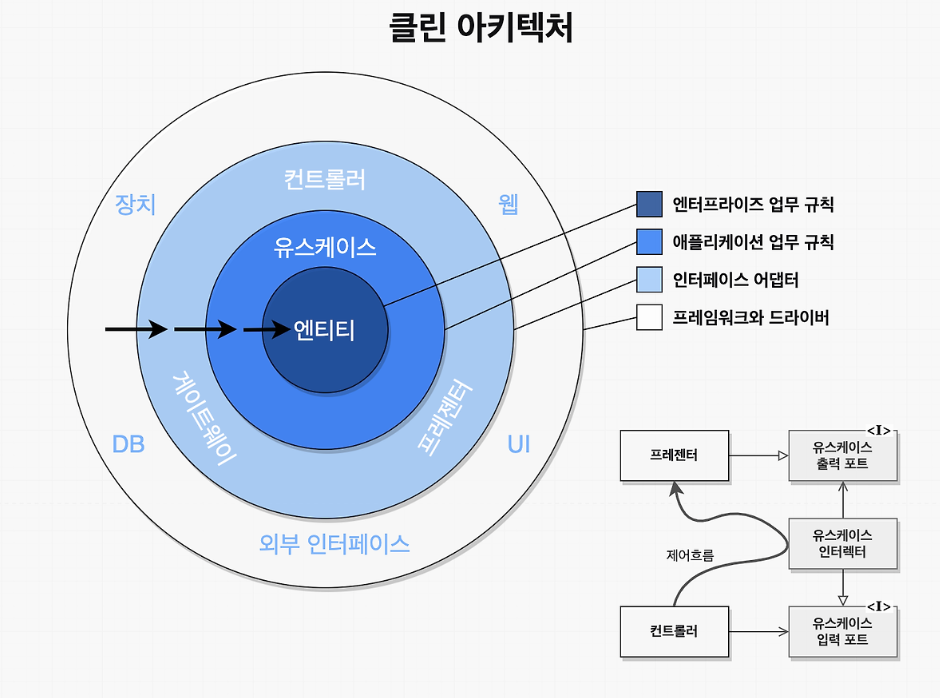

# 22장. 클린 아키텍처

# 23장. 프레젠터와 험블 객체

# 메인 컴포넌트

메인 컴포넌트는 가장 낮은 수준의 정책(가장 바깥쪽 원 영역)이며, 시스템의 초기 진입점이다. 따라서 그 어떤 컴포넌트도 이 메인 컴포넌트를 의존하지 않는다.  

의존성을 주입하는 일은 바로 이 메인 컴포넌트에서 이뤄져야 한다. 즉, 메인은 구체적인 "세부사항"들을 생성한다. 메인은 고수준 시스템을 위한 모든 것을 로드한 후, 제어권을 고수준의 시스템에게 넘긴다.

 

메인을 애플리케이션 플러그인과 같은 존재로 생각하자. 이는 메인 플러그인을 개발용, 테스트용, 상용 등으로 나누어 애플리케이션을 다른 설정으로 실행하도록 할 수 있다.

그림에서는 원의 가장 바깥쪽에 위치한 저수준의 모듈이고, 메인은 고수준의 시스템을 위한 모든것을 로드한 후 제어권을 고수준의 시스템에게 넘긴다.

→ 예를 들면 책에 내용중인 움퍼스 게임에서도 main 함수에서 게임의 메인 루프, 입력 명령어 해석을 처리하지만 이 함수를 호출해서 실제로 처리하는 부분은 다른 고수준 컴포넌트로 위임시킨다.
