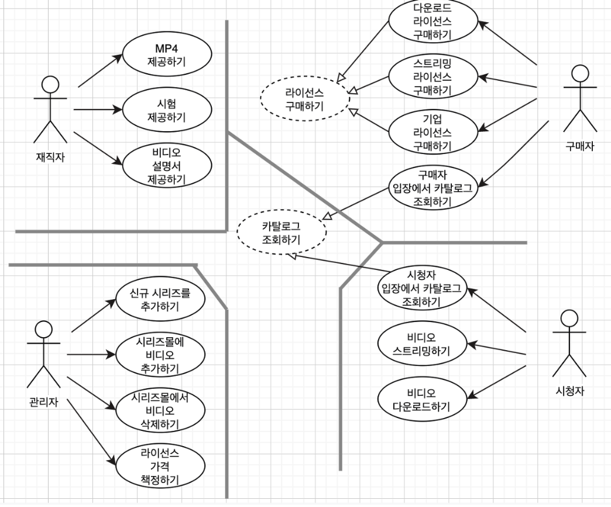
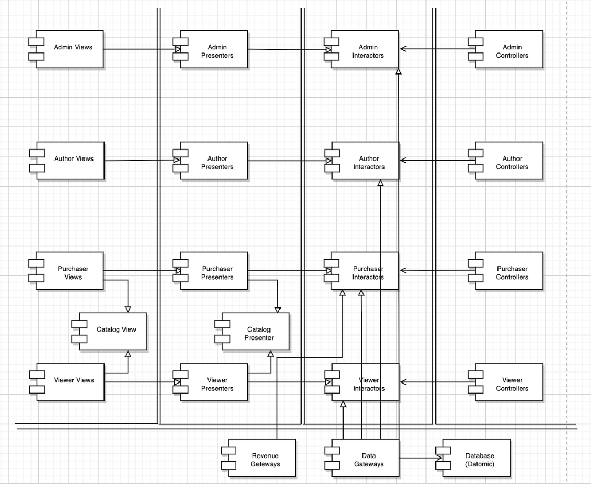
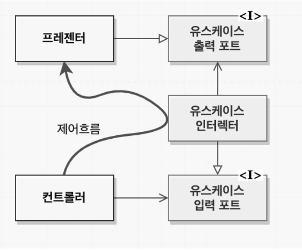

# 33장. 사례 연구 : 비디오 판매

이번 장에서 설명하는 것은 지금까지 살펴본 아키텍처에 대한 규칙과 견해를 종합하여 사례 연구를 살펴보는 장입니다.

사례 연구로 '비디오 판매 사이트'를 선택하였고,
이러한 사이트의 시스템 초기 아키텍처를 결정하는 첫 단계는 액터와 유스케이스를 식별하는 일입니다.

### 유스케이스 분석

비디오 판매 사이트에서 액터는 제작자, 구매자, 관리자, 시청자로 구분됩니다.

단일 책임 원칙에 따르면 이들 네 액터가 시스템이 변경되어야 할 네 가지 주요 근원을 제공하게 될 것입니다. 특정 액터를 위한 변경은 다른 나머지 액터에게 영향을 주지 않아야합니다. (단일 책임 원칙.)

> 단일 책임 원칙 : 단일 책임 원칙은 소프트웨어 모듈은 변경의 이유가 오직 하나뿐(오직 하나의 액터actor에 의해서만 요청되어야 함)이어야 한다는 원칙이다. 즉, 2개 이상의 액터들이 의존하는 모듈은 분리해야 한다.

만약 범용적인 정책을 담고 있다면? 추상 유스케이스로 두고 이를 다를 유스케이스를 구체화 시킵니다.
위의 그림에서는 '카탈로그 조회하기'가 되겠습니다.
(사용자 입장에서의 카탈로그 조회, 구매자 입장에서의 카탈로그 조회)

### 컴포넌트 아키텍처

이제 액터와 유스케이스를 식별했다면, 예비 컴포넌트 아키텍처를 설계할 수 있을 것입니다.

뷰, 프레젠터, 인터랙터, 컨트롤러로 분할하고 각 사이에 경계를 긋습니다. 그리고 각 컴포넌트는 네 종류의 액터에 따라 카테고리로 분리합니다.

추상 유스케이스로 특수한 컴포넌트인 Catalog View와 Catalog Presenter는 해당 컴포넌트 내부에 추상클래스로 코드화되며 이를 상속받는 컴포넌트는 추상클래스로부터 상속받은 뷰와 프레젠터 클래스를 포함할 것입니다.

각 컴포넌트는 단일 .jar에 해당할 수 있지만 경계를 구분해서 뷰, 프레젠터, 인터렉트, 컨트롤러, 유틸리티 등..각각을 합쳐서 하나의 jar로 구분할 수도 있습니다.
이처럼 각 컴포넌트들이 독립적으로 컴파일하고 빌드할 수 있는 환경을 구성될 수 있도록 선택지를 열어두면 시스템이 변경되는 양상에 맞춰 배포 방식을 조절할 수 있게 될 것입니다.

### 의존성 관리

파일만 구분해서는 안되겠죠.. 의존성 관리도 함께 해야할 것입니다.

위의 그림에서 입력이 컨트롤러에서 발생되면 인터렉터에 의해 처리되고 프레젠터가 결과의 포맷을 변경하고 뷰가 화면에 표시되게 됩니다.

제어흐름은 오른쪽에서 왼쪽으로 흐르는게됩니다.
하지만, 컴포넌트 사이의 관계는 대다수 왼쪽에서 오른쪽으로 향하게 됩니다. 이는 의존성 규칙을 준수하기 위함입니다.

모든 의존성은 항상 더 높은 수준의 정책을 포함하는 컴포넌트로 향하게 됩니다. (단방향으로!)

위의 그림에서 다시 살펴보면 사용 관계(색칠된 화살표)는 제어흐름과 같은 방향을 가리키며, 상속 관계 (색칠되지 않는 화살표)는 제어흐름과 반대 방향으로 흐르게 됩니다.

Admin Presenters는 Admin Interactors보다 저수준이기 때문에 Admin Interactors가 Admin Presenters를 의존하여 사용하지 않고
Admin Presenters가 Admin Interactors 컴포넌트에 포함된 인터페이스를 상속하여 구현합니다.
Admin Interactors는 이 인터페이스를 의존하여 의존성 역전이 되게끔 합니다. 이는 저수준의 세부사항의 변경이 고수준에 영향을 미치지 않게하는 개방 폐쇄원칙을 적용했음을 보여줍니다.

### 결론

위와 같이 단일 책임 원칙에 기반하여 액터를 분리하고, 의존성 규칙을 준수하며 코드를 구조화 하면 시스템을 배포하는 방식을 다양하게 선택 할 수 있게 됩니다.
